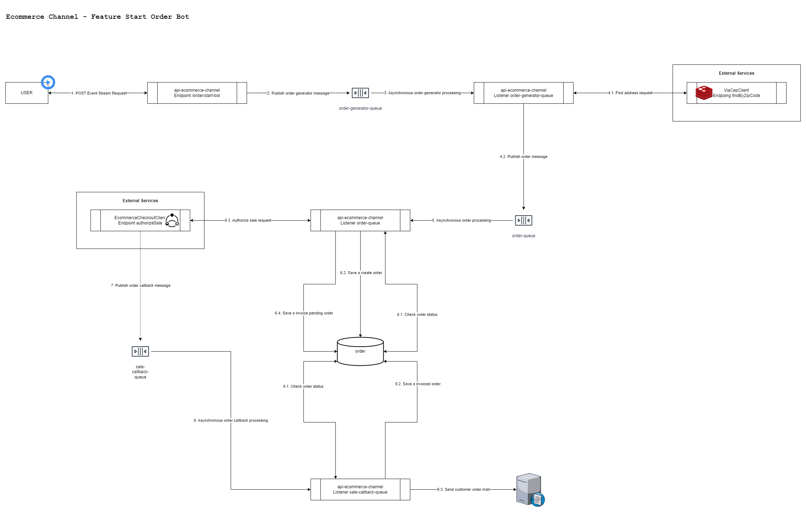
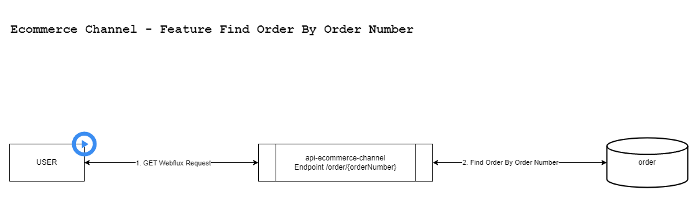
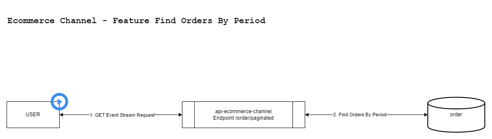
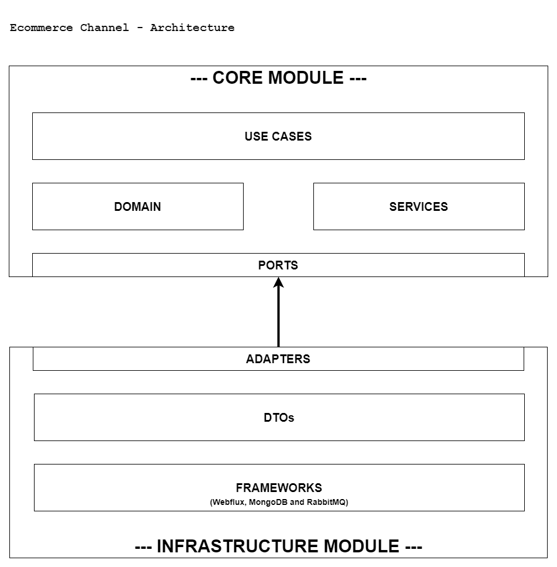

[](https://sonarcloud.io/summary/new_code?id=andersonlemos83_api-ecommerce-channel)
[](https://sonarcloud.io/summary/new_code?id=andersonlemos83_api-ecommerce-channel)
[](https://sonarcloud.io/summary/new_code?id=andersonlemos83_api-ecommerce-channel)
[](https://sonarcloud.io/summary/new_code?id=andersonlemos83_api-ecommerce-channel)
[](https://sonarcloud.io/summary/new_code?id=andersonlemos83_api-ecommerce-channel)

Esta é a versão em português. Para a versão em inglês, clique [aqui](./README.md).

# Sobre o projeto api-ecommerce-channel

Este é um projeto fictício criado exclusivamente para estudo e validação de novas tecnologias.

## Tecnologias e Conceitos

Os principais conceitos e tecnologias que desejo validar incluem:

- **Arquitetura**: Arquitetura Limpa e Arquitetura Hexagonal
- **Framework**: Spring Boot 3.4.3 (Webflux, Netty, Data Mongodb Reactive e Mail)
- **Testes de Aceitação**: Cucumber, WireMock, Greenmail e Testcontainers
- **Banco de Dados**: MongoDB
- **Cache e Tolerância a Falhas**: Redis e Resilience4j

## Inspiração Bibliográfica

📖 *Arquitetura Limpa: O Guia do Artesão Para Estrutura e Design de Software* – Robert C. Martin  
📖 *Desenvolvimento Ágil Limpo: De Volta às Origens* – Robert C. Martin  
📖 *Código Limpo: Habilidades Práticas do Agile Software* – Robert C. Martin  
📖 *Desenvolvimento de Software Orientado a Objetos Guiado por Testes* – Steve Freeman  
📖 *Refatoração: Aperfeiçoando o Design de Códigos Existentes* – Martin Fowler

🎓 *[Formação de Especialista em Microservices Java Spring](https://e-certificado.com/login/visualizar?c=2343053A8150F7A015193380)* – Decoder Project

## Principais Tecnologias e Ferramentas Utilizadas

- **Linguagem**: Java 21 LTS, Gherkin (para BDD com Cucumber)
- **Framework**: Spring Boot 3.4.3 (Webflux, Netty, Data Mongodb Reactive, AMQP, Mail, Data Redis, Validation, Actuator, entre outros)
- **Mensageria e Processamento Assíncrono**: RabbitMQ
- **Testes de Unidade e Aceitação**: JUnit 5, Mockito, Cucumber, WireMock, Greenmail, Testcontainers e Instancio
- **Banco de Dados**: MongoDB
- **Cache e Tolerância a Falhas**: Redis e Resilience4j
- **Documentação da API**: Swagger/OpenAPI
- **Comunicação entre Serviços**: OpenFeign
- **Containerização**: Docker
- **Logging e Monitoramento**: Log4j2 e Spring Boot Actuator
- **Gerenciamento de Dependências**: Maven
- **Controle de Versão**: Git
- **Integração Contínua (CI)**: GitHub Actions
- **Qualidade de Código**: SonarQube

## Domínio

Em um e-commerce fictício com múltiplos canais de venda, incluindo site, aplicativo, loja física e caixa de autoatendimento, 
sempre que um cliente realiza uma compra, o respectivo canal deve faturar cada pedido no sistema orquestrador de vendas, 
registrar todas as transações no banco de dados e, por fim, enviar ao cliente uma cópia da nota fiscal para seu e-mail. 
Esse processo conclui o fluxo de faturamento de pedidos.

Além disso, o cliente poderá consultar suas compras informando o número do pedido ou um período específico.

Por fim, como exercício, deseja-se simular a interação de vários clientes por meio de um robô que realizará compras aleatórias.

## Features

## start-order-bot.feature
### Cenário Base - Iniciar bot de pedidos com todos os dados válidos informados
**Dado** que a quantidade de pedidos aleatórios tenha sido informada  
**Quando** o bot for iniciado por meio do endpoint `/order/start-bot`  
**Então** deverá publicar uma mensagem para cada número pedido gerado na fila `order-generator-queue`  
**E** deverá retornar uma resposta com todos os números de pedidos gerados

## process-order-generation.feature
### Cenário Base - Processar geração de pedido aleatório com todos os dados válidos informados
**Dado** que um número de pedido válido tenha sido informado  
**E** que todos os dados de endereço estejam disponíveis no endpoint `/findByZipCode` do serviço ViaCepClient  
**Quando** a geração do pedido aleatório for processada por meio do listener `order-generator-queue`  
**Então** deverá publicar uma mensagem contendo os dados do pedido gerado na fila `order-queue`

## process-order.feature
### Cenário Base - Processar pedido com todos os dados válidos informados
**Dado** que todos os dados válidos do pedido tenham sido informados  
**Quando** o pedido for processado por meio do listener `order-queue`  
**Então** o sistema deverá autorizar o faturamento do pedido junto ao endpoint `/authorize-sale` do serviço EcommerceCheckoutClient  
**E** deverá registrar um pedido aguardando nota fiscal na base de dados

## process-order-callback.feature
### Cenário Base - Processar um callback pedido com todos os dados válidos informados
**Dado** que todos os dados válidos de um callback pedido tenham sido informados  
**E** que exista um pedido aguardando nota fiscal na base de dados 
**Quando** o pedido callback for processado por meio do listener `sale-callback-queue`  
**Então** deverá registrar um pedido com nota fiscal na base de dados  
**E** deverá enviar um email contendo os dados do pedido com nota fiscal para o cliente

## find-order-by-order-number.feature
### Cenário Base - Consultar pedido existente na base de dados por número pedido
**Dado** que existam pedidos na base de dados  
**Quando** o pedido for consultado por meio do endpoint `/order/{orderNumber}`  
**Então** deverá retornar uma resposta com todos os dados do pedido esperado

## find-orders-by-period.feature
### Cenário Base - Consultar pedidos existentes na base de dados por período
**Dado** que um período válido tenha sido informado  
**E** que existam pedidos na base de dados  
**Quando** os pedidos forem consultados por meio do endpoint `/order/paginated`  
**Então** deverá retornar uma resposta com todos os pedidos do período

## Fluxo das funcionalidades



[Ver em tela cheia](./script/diagrams/feature-start-order-bot.png)



[Ver em tela cheia](./script/diagrams/feature-find-order-by-order-number.png)



[Ver em tela cheia](./script/diagrams/feature-find-orders-by-period.png)

## Arquitetura

O projeto Ecommerce Channel foi desenvolvido seguindo os princípios da arquitetura limpa (Clean Architecture) e hexagonal (Hexagonal Architecture), estruturado da seguinte forma 

- **Módulo Core**: Responsável por centralizar as regras de negócio na sua forma mais pura, minimizando ao máximo a dependência de frameworks e tecnologias externas. 
- **Módulo Infratrutura**: Responsável pela integração das informações de entrada e saída, utilizando diferentes tecnologias e frameworks para comunicação com bancos de dados, APIs e outros sistemas.



[Ver em tela cheia](./script/diagrams/architecture.png)

## Requisitos

- Java JDK 21
- Maven 3.6.2 ou superior
- Docker (Necessário para o Testcontainer e para subir a aplicação localmente)

## Primeiros Passos

- **Baixar todas as dependências do projeto**:
  ```
    mvn dependency:resolve -U
  ```
- **Executar o build do projeto**:
  ```
    mvn -U -B clean install -Dmaven.test.skip=true
  ```
- **Executar o build do projeto executando todos os testes**:
  ```
    mvn -U -B clean install
  ```

## Sobre os Testes

Para organizar os testes de acordo com seu tipo e função, eles foram agrupados em três grandes suítes:

- **RunCucumberTest**: Contém todos os testes de aceitação implementados com Cucumber e BDD. Essa suíte possui uma execução mais lenta, pois exige a inicialização do contexto e da infraestrutura.
- **UnitTests**: Contém todos os testes de unidade do projeto. Por não possuir dependências externas, a sua execução é rápida.
- **AllTests**: Agrupa todos os testes implementados, combinando os testes de aceitação (RunCucumberTest) e os testes de unidade (UnitTests).

## Começando com a Aplicação

- **Wiremock**:
1. Subir uma instância do Wiremock:
  ```
    docker-compose -f .\script\docker\wiremock.yml up -d
  ```

2. Testar a instância do Wiremock: 
  ```
    curl --location 'http://localhost:8443/authorize-sale' --header 'Content-Type: application/json' --data '{"anyData": 0}'
  ```

- **Redis**:
1. Subir uma instância do Redis:
  ```
    docker-compose -f .\script\docker\redis.yml up -d
  ```

2. Testar a instância do Redis:
  ```
    1. docker exec -it redis /bin/bash
    2. redis-cli
    3. KEYS "*"
    4. exit
    5. exit
  ```

- **RabbitMQ**:
1. Subir uma instância do RabbitMQ:
  ```
    docker-compose -f .\script\docker\rabbitmq.yml up -d
  ```

2. Acessar a instância do RabbitMQ:
   [Acessar RabbitMQ Admin](http://localhost:15672/)

3. Logar no RabbitMQ Admin com guest:
  ```
    username: guest
    password: guest
  ```

4. Criar um novo usuário ecommerce-channel:
  ```
    1. Acessar /Admin/User
    2. Preencha Username: ecommerce-channel, Password: ecommerce-channel e Tags: administrator
    3. Aperte "Add user" 
  ```

5. Criar um novo virtual host ecommerce-checkout:
  ```
    1. Acessar /Admin/Virtual Hosts
    2. Preencha Name: ecommerce-checkout e Default Queue Type: Classic
    3. Aperte "Add virtual host" 
  ```

6. Adicionar permissão do usuário ecommerce-channel ao virtual host ecommerce-checkout:
  ```
    1. Acessar /Admin/Virtual Hosts/ecommerce-checkout
    2. Preencha User: ecommerce-channel, Configure regexp: .*, Write regexp: .* e Read regexp: .*
    3. Aperte "Set permissions" 
  ```

- **MongoDB**:
1. Subir uma instância do MongoDB:
  ```
    docker-compose -f .\script\docker\mongodb.yml up -d
  ```

2. Acessar a instância do Mongo Express:
   [Acessar Mongo Express](http://localhost:8081/)

3. Logar no Mongo Express com express:
  ```
    username: express
    password: express
  ```

- **Mailhog**:
1. Subir uma instância do Mailhog:
  ```
    docker-compose -f .\script\docker\mailhog.yml up -d
  ```

2. Acessar a instância do Mailhog:
   [Acessar Mailhog](http://localhost:8025/)

- **Executando a Aplicação**:
1. Crie e execute um Spring Boot runner:
  ```
    Main Class: /infrastructure/src/main/java/br/com/alc/ecommerce/channel/infrastructure/EcommerceChannelInfrastructureApplication.java
    Profile: local (application-local.yml)
  ```

2. Acessar Swagger UI:
   [Acessar Swagger UI](http://localhost:8383/swagger-ui.html)

3. Importar Collection do Postman:
   [api-ecommerce-channel.postman_collection.json](./script/postman/api-ecommerce-channel.postman_collection.json)

4. Testar aplicação:
  ```
  1. Enviar um request POST para http://localhost:8383/order/start-bot (Use Swagger ou Postman!);
  2. Enviar um request GET para http://localhost:8383/order/{order_number} com um número de pedido retornado no passo 1 (Use Swagger ou Postman!);
  3. Verificar se o response do passo 2 possui o status=INVOICE_PENDING;
  4. Publicar na fila "sale-callback-queue" a mensagem "sale-callback-queue-message.json" ajustando o número do pedido para o retornado no passo 1 (Use RabbitMQ Admin!);
  5. Enviar um request GET para http://localhost:8383/order/paginated com um período válido (Use Swagger ou Postman!);
  6. Verificar se o response do passo 5 possui o status=INVOICED;
  7. Verificar se foi enviado a nota fiscal para o Mailhog.
  ```
   [sale-callback-queue-message.json](./script/rabbit/sale-callback-queue-message.json)

## That's all folks!

Espero que tenha gostado.